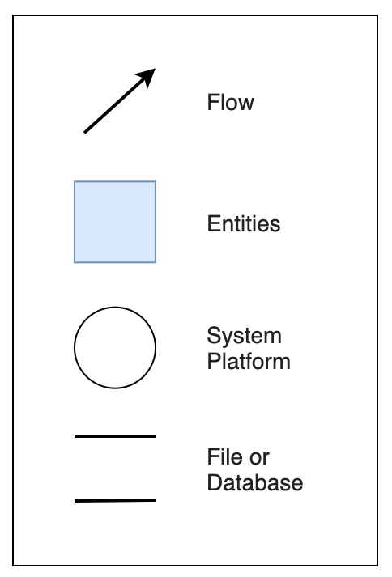
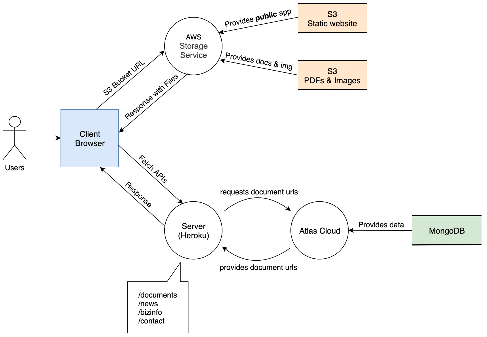
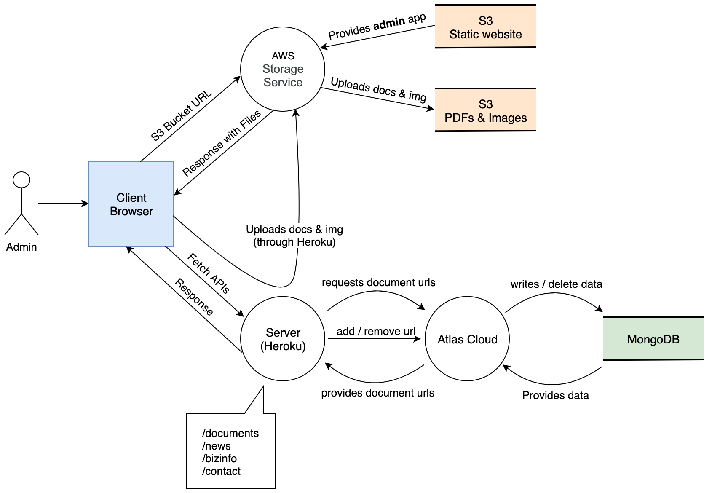
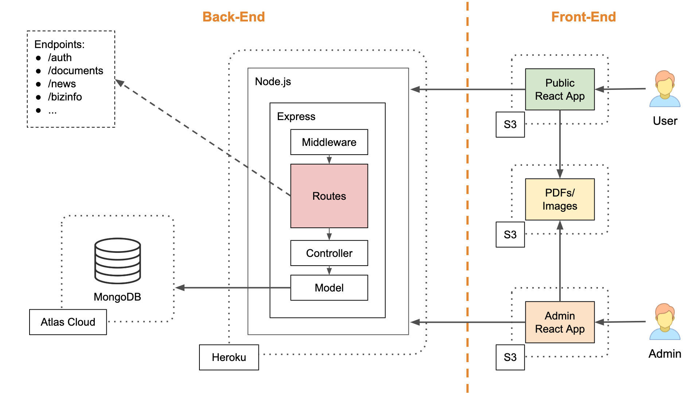
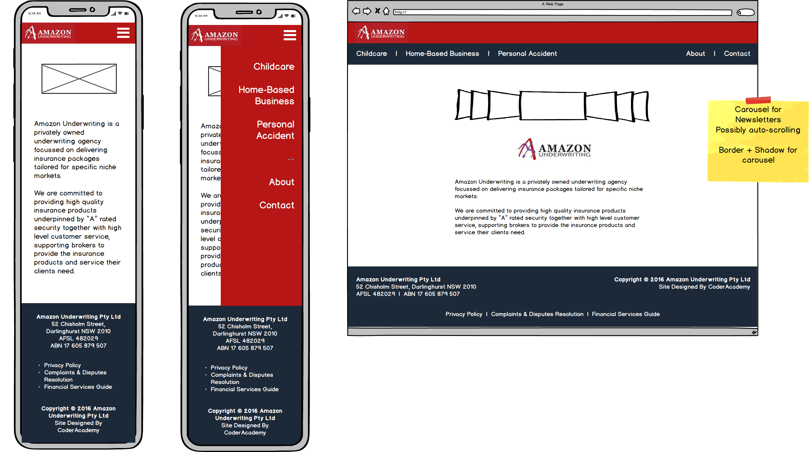
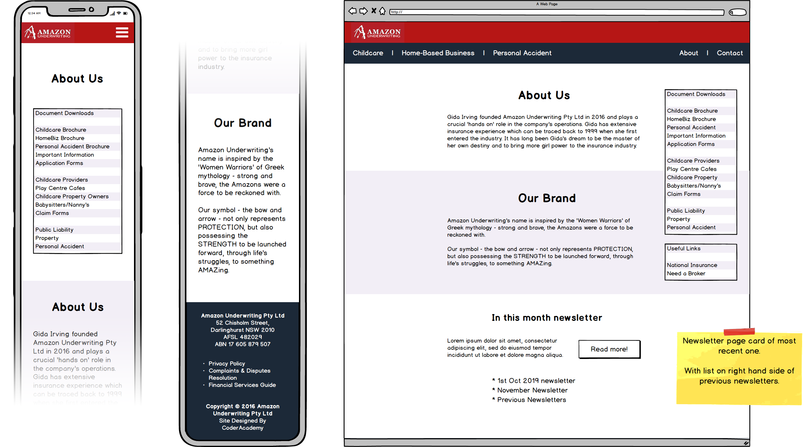
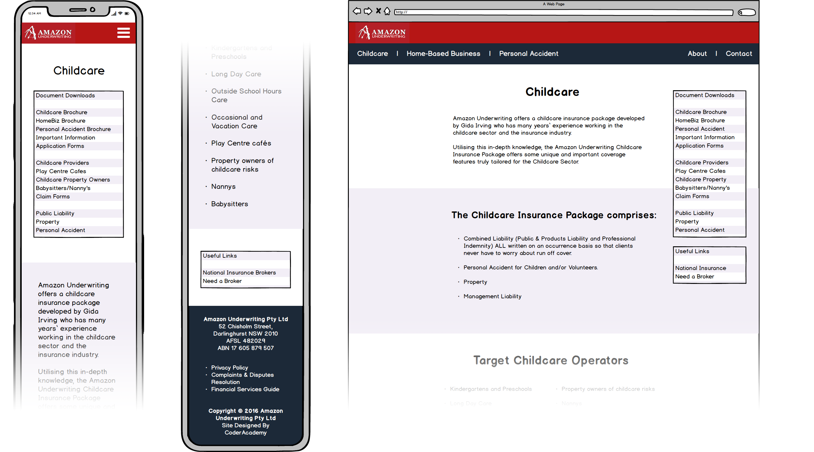
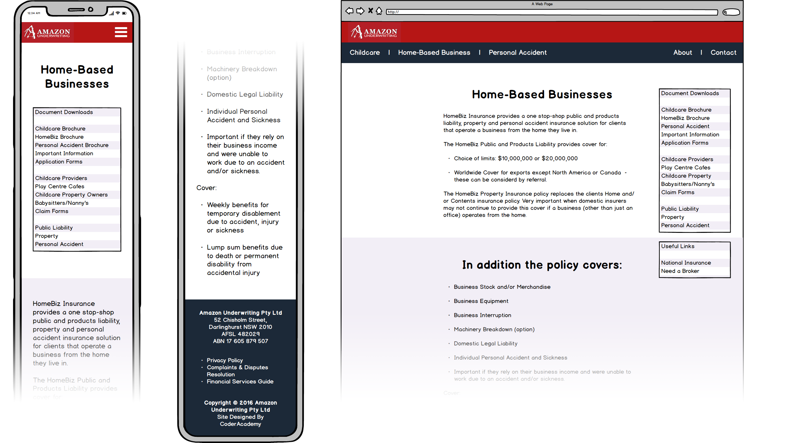
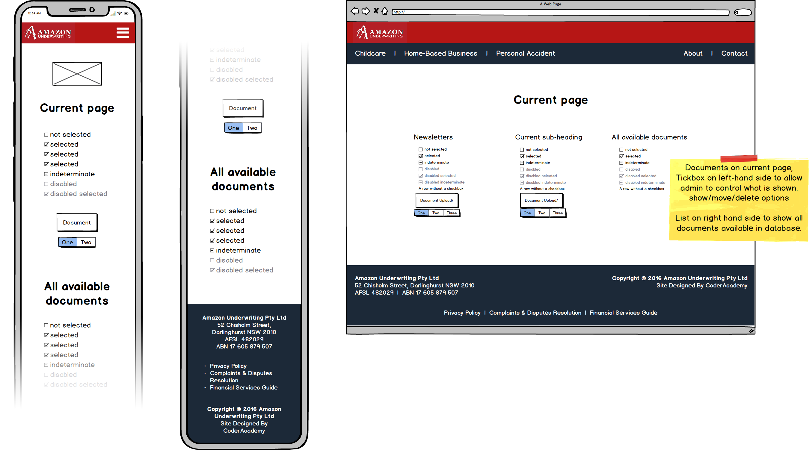
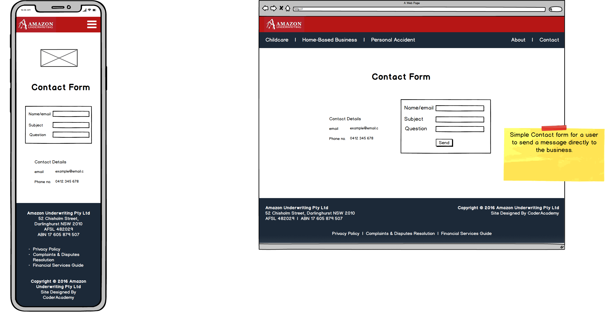

# Amazon Underwriting - Public Frontend

### Links to deployed website

* [Public frontend](http://auw-user-app.s3-website-ap-southeast-2.amazonaws.com)
* [Admin frontend](http://auw-admin-app.s3-website-ap-southeast-2.amazonaws.com)

### Links to GitHub repository

* [Public frontend](https://github.com/ironest/amazon-underwriting-public-frontend)
* [Admin frontend](https://github.com/ironest/amazon-underwriting-admin-frontend)
* [Backend](https://github.com/ironest/amazon-underwriting-backend)

## Intro

The project revolves around the **Amazon Underwriting Pty Ltd** business; they are a privately owned underwriting agency focussed on delivering insurance packages tailored for specific niche markets.

### Purpose

Create a website to be used as a landing page in order to advertise **Amazon Underwriting PTY Ltd** on the internet with a more modern UI/UX. Along with improvements to its functionality/usability with a simple to use admin-only page that gives the owner an easy way to update parts of the website they may need to update regularly.

The purpose of this project has **two objectives**:
1. Rebuilding the current production-live version of the [Amazon-Underwriting](https://amazonunderwriting.com.au/) website to give it a newer/fresher design and a smoother user experience.
2. Creating a parallel web-app to be used as an admin-panel through which the business owner can autonomously manage content and media of the public website.

### Functionality

* Database provisioning
* Collection of user contact details
* Authentication for Admin User
* Administrator panel
  * Upload of new documents
  * Deletion of old documents
  * Hide/Show of WIP documents
* Single page application
* Dynamic newsletter
* Responsive layout

### Tech Stack

Core technologies are the MERN stack (MongoDB, Express, React and Node.js)

## Dataflow Diagrams (Yourdon/DeMarco notation)

**Legend**



---

**Users scenario**



---

**Admin scenario**



## Application Architecture Diagram



### Getting Started

Each project requires a quick configuration before being usable; configuration relies on few environment variables variables which can be prepared through a `.env` file in the root of each project.

The **backend project** requires:
```
DB_HOST=mongodb://localhost/<yourDBName>
PORT=
JWT_SECRET=
AWS_ACCESS_KEY=
AWS_SECRET_ACCESS_KEY=
AWS_REGION=
AWS_BUCKET_NAME=
```

The **public Frontend project** requires:
```
REACT_APP_BASEURL=<yourExpressAppURL>
PORT=
```

The **admin Frontend project** requires:
```
REACT_APP_BASEURL=<yourExpressAppURL>
PORT=
```

**Once finished with the configuration steps**, it is possible to start each individual project:

**1. To spin up the backend server:**
   * open a terminal and move to folder `./src/backend`
   * install any dependencies by running `npm install`
   * Seed the database (including admin credential) with the command `npm run seed`
   * start the server with `npm run dev-server`

**2. To start the public frontend**
   * open a new terminal and move to `./src/public-frontend`
   * install any dependencies by running `npm install`
   * start the app with `npm start`

**3. To start the admin frontend (acting as CMS)**
   * open a new terminal and move into `./src/admin-frontend`
   * install any dependencies by running `npm install`
   * start the app with `npm start`

**4. To visit the public frontend app`**
   * open a browser window and visit `http://localhost:3002/`

**5. To visit the admin frontend app**
   * open a browser window and visit `http://localhost:3001`

The credential currently held in the database are:
```
  email: user@domain.com
  password: password
```

### Backend libraries

* **aws-sdk**: The official AWS SDK for JavaScript
* **celebrate**: An express middleware function that wraps the joi validation library. This allows you to use this middleware in over routes
* **cors**: A node.js package for providing a Connect/Express middleware that can be used to enable CORS with various options.
* **dotenv**: A dependency module that loads environment variables from a .env file into process.env
* **jsonwebtoken**: Javascript implementation of JSON Web Tokens.
* **method-override**: Npm module that allows you use HTTP verbs such as PUT or DELETE in places where the client doesn't support it.
* **mongoose**: A MongoDB object modeling tool designed to work in an asynchronous environment.
* **mongoose-bcrypt**: Mongoose plugin encrypting field(s) with bcrypt and providing methods to encrypt and verify
* **multer**: A node.js middleware for handling multipart/form-data, which is primarily used for uploading files
* **passport**: A middleware for Node.js to handle authenticate requests, which it does through an extensible set of plugins known as strategies
* **passport-jwt**: A module that lets you authenticate endpoints using a JSON web token. It is intended to be used to secure RESTful endpoints without sessions.
* **passport-local**: Passport strategy for authenticating with a username and password; this module lets you authenticate using a username and password in your Node.js applications.

### Frontend libraries

* **axios**: Promise based HTTP client for the browser and node.js
* **node-sass**: It's a library that allows you to natively compile .scss files to css at incredible speed and automatically via a connect middleware.
* **normalize.css**: Makes browsers render all elements more consistently and in line with modern standards. It precisely targets only the styles that need normalizing
* **react**: React is a JavaScript library for creating user interfaces.
* **react-dom**: Entry point to the DOM and server renderers for React. It is intended to be paired with the generic React package, which is shipped as react to npm
* **redux & react-redux**: Predictable state container for JavaScript apps. It helps you write applications that behave consistently across different environments
* **redux-thunk**: Thunk middleware for Redux
* **react-responsive-carousel**: Powerful, lightweight and fully customizable carousel component for React apps.

### Formal testing frameworks

**Cypress**
Cypress is a fast, easy and reliable front end testing tool built for anything that runs in a browser.
Cypress was employed to test the following major feature of our (admin) front-end app:
* Authentication
* NavBar Menu
* Childcare Documents
* Home Based Businesses Documents
* Personal Accident Documents

**Jest / Supertest**
Jest is a JavaScript Testing Framework maintained by Facebook.
Our team utilised Jest to verify the specific correctness of the backend.
Feature stimulated:
* Authentication
* Links routes (get)
* News routes (get)
* Section routes (get)
* Page routes (get)
* Info routes (get)
* Link deletion (including Bearer token)
* News deletion (including Bearer token)

## Wireframes

* **Homepage**



* **About Us**



* **Childcare**



* **Home-based Businesses**



* **Admin Panel**



* **Contact Form**


